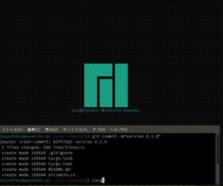

# Color-Checker

This application is simple RGB color checker.

You can adjust the color while looking at it and see the result.

## Usage

Pressed keyboard.

- `R` key. RGB's R is incremented.
- `E` key. RGB's R is decremented.
- `G` key. RGB's G is incremented.
- `F` key. RGB's G is decremented.
- `B` key. RGB's B is incremented.
- `V` key. RGN's B is decremented.

If you close the window, RGB's values is displayed on terminal.
